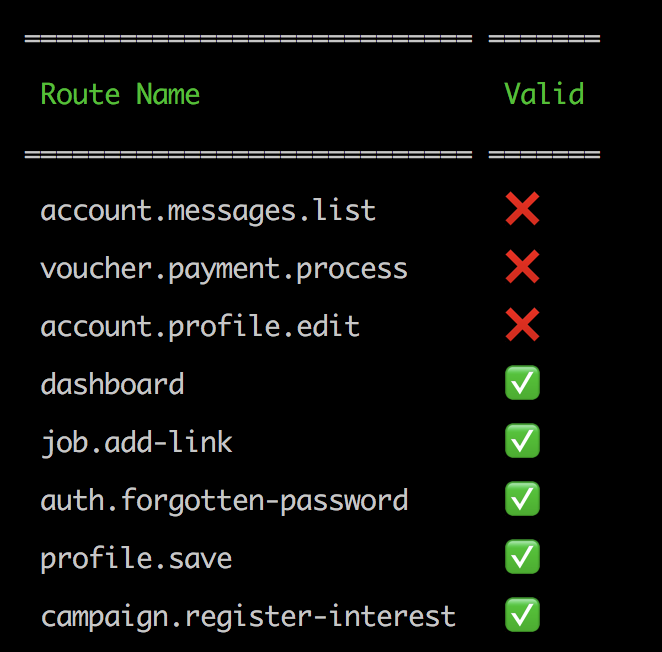

## Laravel Route Checker

This package parses your Laravel project, finds calls to the `route()` function, and check that the string 
corresponds to a registered route.
 


## Installation

```
composer require --dev juddling/laravel-route-checker
```

Add the service provider to `config/app.php`:

```
\Juddling\RouteChecker\RouteCheckerServiceProvider::class,
```

##  Usage
```
php artisan juddling:find-invalid-routes
```